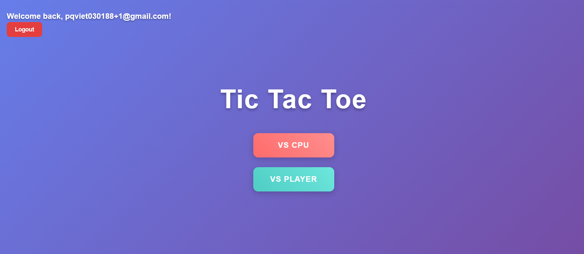
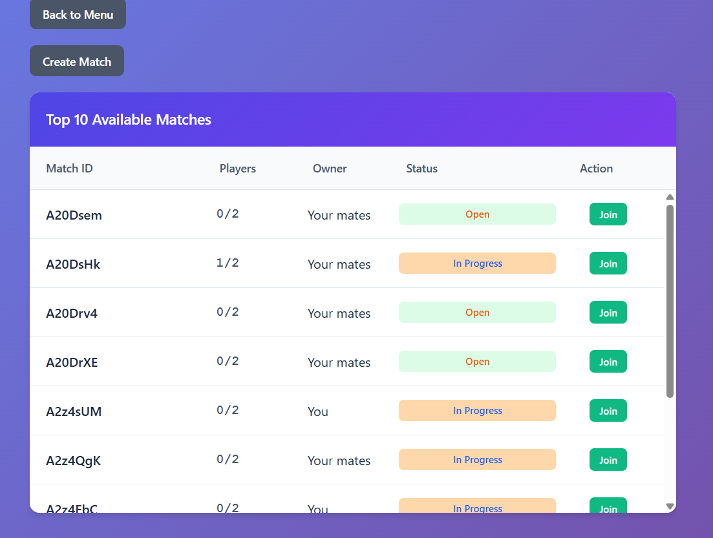
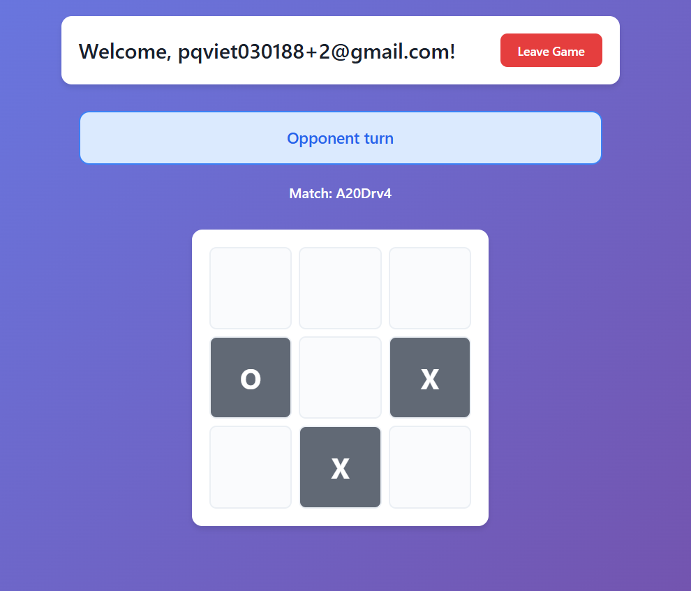

# 🎮 TicTacToe – Real-time Multiplayer Game

A full-stack real-time multiplayer TicTacToe game with authentication, live updates via SignalR, and both single-player (vs CPU) and multiplayer modes.

Built with **React + TypeScript (Vite)** on the frontend and **.NET 8 + SignalR** on the backend, backed by **MongoDB** and **Redis**.

The app is deployed on AWS using ECS and API Gateway. Please access the app from this [link](http://tictactoe-dev-alb-2055555245.ap-southeast-2.elb.amazonaws.com/game)

---

## 📸 Screenshots

### Game Menu

*Main menu with options to play vs CPU or vs Player*

### Match Lobby

*Browse and join available multiplayer matches in real-time*

### In-Game

*Live multiplayer gameplay with real-time move synchronization*

---

## ✨ Features

### 🎯 Core Gameplay
- **Single Player Mode**: Play against CPU with server-computed moves
- **Multiplayer Mode**: Real-time matches against other players via SignalR
- **Live Match Updates**: Instant game state synchronization across all connected clients
- **Match Lobby**: Browse and join available matches in real-time

### 🔐 Authentication & Security
- **JWT-based Authentication**: Secure access and refresh token flow
- **HTTP-Only Cookies**: Server-side cookie management for enhanced security
- **Protected Routes**: Client-side route protection with authentication guards
- **SignalR Authentication**: JWT validation for WebSocket connections

### 🏗️ Technical Architecture
- **SignalR Hubs**: Real-time bidirectional communication (Lobby & Room hubs)
- **Redux Saga**: Async state management with side effects handling
- **MongoDB**: User and match data persistence
- **Redis**: SignalR backplane for horizontal scaling
- **Docker Support**: Full containerized development environment

---

## 🛠️ Tech Stack

### Frontend
- **React 18** with TypeScript
- **Redux Toolkit** + **Redux Saga** for state management
- **React Hook Form** for form validation
- **Hyperfetch** for type-safe API calls
- **SignalR Client** for real-time communication
- **Vite** for fast development and building

### Backend
- **.NET 8 Web API**
- **SignalR** for real-time WebSocket communication
- **MongoDB Driver** for database operations
- **JWT Authentication** (System.IdentityModel.Tokens.Jwt)
- **FluentValidation** for request validation
- **xUnit** + **Mongo2Go** for integration testing

### Infrastructure
- **MongoDB** – Database
- **Redis** – SignalR backplane
- **Docker Compose** – Container orchestration

---

## 📦 Installation & Setup

### Prerequisites
- **Docker Desktop** (required for easiest setup)
- **Node.js** 18+ and npm (optional, for local development)
- **.NET 8 SDK** (optional, for local development)

---

## 🐳 Docker Compose Configurations

This project includes two Docker Compose files for different purposes:

### 1. `docker-compose-dev.yaml` – Full Development Environment

**Use this for active development with hot reload:**

```bash
# Start all services (Frontend + Backend + MongoDB + Redis)
docker-compose -f docker-compose-dev.yaml up --build
```

**Services included:**

| Service | Port | Description |
|---------|------|-------------|
| **client** | 5173 | Vite dev server with hot reload |
| **api** | 5000 | .NET Web API with watch mode |
| **mongo** | 27018 | MongoDB database |
| **redis** | 6379 | Redis for SignalR backplane |
| **redisinsight** | 5540 | Redis management UI |

**Features:**
- 🔥 Hot Module Replacement (HMR) for React
- 🔄 .NET watch mode for automatic recompilation
- 📦 Volume mounts for live code updates
- 🐛 Full debugging support

### 2. `docker-compose-integration-test.yaml` – Test Infrastructure Only

**Use this for running integration tests locally:**

```bash
# Start only MongoDB & Redis (no frontend/backend)
docker-compose -f docker-compose-integration-test.yaml up -d

# Run backend tests
cd Backend/TictactoeTest
dotnet test
```

**Services included:**

| Service | Port | Description |
|---------|------|-------------|
| **mongo** | 27018 | MongoDB for tests |
| **redis** | 6379 | Redis for SignalR tests |
| **redisinsight** | 5540 | Redis management UI |

---

## 🚀 Quick Start Guide

### For Development:

```bash
# Clone the repository
git clone https://github.com/pqviet030188/tictactoe.git
cd tictactoe

# Start all development services
docker-compose -f docker-compose-dev.yaml up --build
```

**That's it!** The application will be available at:
- **Frontend**: http://localhost:5173
- **Backend API**: http://localhost:5000
- **RedisInsight**: http://localhost:5540

### For Integration Testing:

```bash
# Start test infrastructure
docker-compose -f docker-compose-integration-test.yaml up -d

# Run tests in another terminal
cd Backend/TictactoeTest
dotnet test

# Stop infrastructure when done
docker-compose -f docker-compose-integration-test.yaml down
```

### 🛠️ Alternative: Local Development (Without Docker)

If you prefer to run services locally without Docker:

#### 1. Start Infrastructure Only
```bash
docker-compose -f docker-compose-integration-test.yaml up -d
```

#### 2. Start Backend Locally
```bash
cd Backend/Tictactoe
dotnet restore
dotnet run
```
Backend runs at `http://localhost:5000`

#### 3. Start Frontend Locally
```bash
cd Frontend
npm install
npm run dev
```
Frontend runs at `http://localhost:5173`

---

## 🔧 Docker Commands Reference

```bash
# Development - Start all services
docker-compose -f docker-compose-dev.yaml up

# Development - Rebuild and start
docker-compose -f docker-compose-dev.yaml up --build

# Development - Start in background (detached)
docker-compose -f docker-compose-dev.yaml up -d

# Development - View logs
docker-compose -f docker-compose-dev.yaml logs -f

# Development - Stop all services
docker-compose -f docker-compose-dev.yaml down

# Testing - Start infrastructure only
docker-compose -f docker-compose-integration-test.yaml up -d

# Testing - Stop infrastructure
docker-compose -f docker-compose-integration-test.yaml down

# Remove all volumes (clean slate)
docker-compose -f docker-compose-dev.yaml down -v
```


## 🎮 How to Play

### Single Player (vs CPU)
1. Navigate to the Game menu
2. Click **"vs CPU"**
3. Make your moves – the server computes CPU responses automatically

### Multiplayer
1. Register/Login to create an account
2. Go to **Lobby** to see available matches
3. Click **"Create Match"** to host a game or **"Join"** to join an existing match
4. Wait for another player to join
5. Play in real-time with live move updates

---

## 🏗️ Project Structure

```
tictactoe/
├── Backend/
│   └── Tictactoe/
│       ├── Controllers/          # REST API endpoints (Auth)
│       ├── Hubs/                 # SignalR hubs (Lobby, Room)
│       │   └── Filters/          # Hub filters for auth & authorization
│       ├── Services/             # Business logic (User, Token, Computation)
│       ├── Repositories/         # Data access layer (User, Match)
│       ├── Models/               # Domain models (User, Match)
│       ├── DTOs/                 # Data transfer objects & validation
│       ├── Configurations/       # DI and service registration
│       ├── Extensions/           # Helper extensions
│       ├── Helpers/              # Utility helpers
│       └── Migrations/           # Database migrations
│   └── TictactoeTest/           # Integration & unit tests
├── Frontend/
│   └── src/
│       ├── components/           # React components (Game, Auth, UI)
│       ├── store/                # Redux slices (user, match)
│       ├── sagas/                # Redux Saga side effects (API, SignalR)
│       ├── api/                  # API client & request definitions
│       ├── hubs/                 # SignalR hub connections
│       ├── hooks/                # Custom React hooks
│       ├── services/             # Client-side services (auth, cookies)
│       └── types/                # TypeScript type definitions
├── docker-compose.yaml           # Docker orchestration
├── redis/
│   └── redis.conf               # Redis configuration
└── README.md
```

---

## 🔑 Key Technical Features

### Authentication Flow
1. User registers/logs in via REST API
2. Backend sets HTTP-only cookies (`x-access-token`, `x-refresh-token`)
3. Frontend automatically includes cookies in requests via `credentials: 'include'`
4. SignalR connections authenticated via JWT in query string (`AccessTokenProvider`)
5. Automatic token refresh on 401 responses

### Real-time Communication
- **Lobby Hub** (`/lobby`): Broadcasts match list updates to all connected clients
- **Room Hub** (`/room`): Manages game room membership and move synchronization
- **SignalR Groups**: Efficient message routing to relevant clients only
- **Fire-and-Forget Cleanup**: Non-blocking disconnection handling for match cleanup

### State Management
- **Redux Toolkit**: Type-safe state slices with Immer
- **Redux Saga**: Side effects handling (API calls, SignalR events, async workflows)
- **Normalized State**: Efficient user and match lookups by ID
- **takeLatest Pattern**: Automatic cancellation of outdated requests

### Hub Authorization
- **AccessTokenHubFilter**: JWT validation before hub method execution
- **RoomHubFilter**: Room membership authorization (creator/member checks)
- **Typed Error Responses**: Type-safe error handling with proper SignalR protocol

---

## 🧪 Testing

### Backend Tests
```bash
cd Backend/TictactoeTest
dotnet test
```

**Test Coverage:**
- SignalR hub integration tests with TestServer
- JWT authentication in hub connections
- MongoDB repository operations with Mongo2Go
- Match creation, joining, and move validation
- Cookie-based authentication flow

**Test Features:**
- `IClassFixture<MongoFixture>` for shared in-memory database
- `IAsyncLifetime` for proper test setup/cleanup
- Custom `TestDatabaseCollection` with GUID-prefixed collections for isolation
- SignalR client connections with `AccessTokenProvider`

### Frontend Tests
```bash
cd Frontend
npm test
```

**Test Coverage:**
- **Redux Saga Tests**: Unit tests for saga side effects
  - Lobby saga: Hub connection, lobby join, match creation
  - Room saga: Hub connection, room join, move handling, disconnection flow
  - Uses `redux-saga-test-plan` for declarative saga testing
  - Mock SignalR hub invocations with type-safe responses

- **React Component Tests**: Integration tests with Redux store
  - Match component: Full game flow
  - Configurable saga handlers via `mockSagaHandlers` pattern
  - Event channel simulation for hub callbacks
  - User interaction testing with `@testing-library/react`

**Test Features:**
- **Jest + ts-jest**: TypeScript support with CommonJS for tests
- **Redux Provider Integration**: Tests use isolated store instances via `setupStore()`
- **Event Channel Pattern**: Hub callbacks emit actions through saga channels
- **Mock Hub Events**: Trigger SignalR events programmatically in tests
- **Type Safety**: Full TypeScript coverage with proper typing for mocks
- **Configurable Mocks**: Per-test customization of saga behavior without code duplication

---

## 🔧 Configuration

### Backend (`Backend/Tictactoe/appsettings.json`)
```json
{
  "Logging": {
    "LogLevel": {
      "Default": "Information",
      "Microsoft.AspNetCore": "Warning"
    }
  },
  "Jwt": {
    "Key": "your-secret-key-minimum-32-characters",
    "Issuer": "TictactoeIssuerDev",
    "Audience": "TictactoeAudienceDev",
    "AccessTokenMinutes": 60,
    "RefreshTokenDays": 7
  },
  "MongoDb": {
    "ConnectionString": "mongodb://localhost:27017/Tictactoe"
  },
  "Redis": {
    "ConnectionString": "localhost:6379,user=rex,password=rex112233"
  },
  "CorsPolicy": {
    "Use": "Development",
    "Policies": [
      {
        "Name": "Development",
        "AllowedOrigins": ["http://localhost:5173"],
        "AllowAnyHeader": true,
        "AllowAnyMethod": true,
        "AllowCredentials": true
      }
    ]
  },
  "Https": {
    "Enabled": false,
    "RedirectToHttps": false,
    "RequireHttpsMetadata": false
  }
}
```

### Frontend (`.env`)
```env
VITE_API_BASE_URL=http://localhost:5000
VITE_APP_NAME=TicTacToe
VITE_JWT_COOKIE_NAME=x-access-token
VITE_REFRESH_COOKIE_NAME=x-refresh-token
```

### Docker Environment Variables

**Frontend (in `docker-compose.yaml`):**
```yaml
environment:
  - VITE_API_BASE_URL=http://localhost:5000
  - VITE_APP_NAME=TicTacToe
  - VITE_JWT_COOKIE_NAME=x-access-token
  - VITE_REFRESH_COOKIE_NAME=x-refresh-token
```

**Backend (in `docker-compose.yaml`):**
```yaml
environment:
  - ASPNETCORE_URLS=http://+:5000
  - Redis__ConnectionString=redis:6379,user=rex,password=rex112233
  - MongoDb__ConnectionString=mongodb://mongo:27017/Tictactoe
  - CorsPolicies__Use=Default
  - CorsPolicies__Policies__0__Name=Default
  - CorsPolicies__Policies__0__AllowedOrigins__0=http://localhost:5173
  - CorsPolicies__Policies__0__AllowAnyHeader=true
  - CorsPolicies__Policies__0__AllowAnyMethod=true
  - CorsPolicies__Policies__0__AllowCredentials=true
  - Jwt__Issuer=TictactoeIssuerDev
  - Jwt__Audience=TictactoeAudienceDev
  - Jwt__AccessTokenMinutes=60
  - Jwt__RefreshTokenDays=7
  - Jwt__Key=ThisIsADevelopmentKeyForTictactoeApplication12345
```

---

## 📝 API Endpoints

### Authentication (`/auth`)
- **POST /auth/register** – Create new user account
  - Body: `{ "email": "user@example.com", "password": "password123" }`
  - Returns: `{ "message": "User created successfully" }`
  
- **POST /auth/login** – Authenticate and set HTTP-only cookies
  - Body: `{ "email": "user@example.com", "password": "password123" }`
  - Sets cookies: `x-access-token`, `x-refresh-token`
  - Returns: `{ "message": "Login successful" }`
  
- **POST /auth/refresh** – Refresh access token using refresh token from cookie
  - No body required (reads from cookie)
  - Returns: New tokens set in cookies
  
- **GET /auth/user** – Get current authenticated user info
  - Requires: Valid JWT in cookie or Authorization header
  - Returns: `{ "id": "...", "email": "..." }`

### SignalR Hubs

#### Lobby Hub (`/lobby`)
**Methods:**
- `JoinLobby()` – Join global lobby and receive current match list
  - Returns: `MatchResults` with available matches
  
**Events (Server → Client):**
- `MatchesCreated` – Broadcasted when new matches are created
- `MatchesUpdated` – Broadcasted when matches are updated
  - Payload: `MatchResults` with updated match list

#### Room Hub (`/room`)
**Methods:**
- `UpdateRoomActivity(RoomActivityUpdateRequest)` – Join room, leave room, or make a move
  - Request: `{ roomId, roomActivity: "JoinRoom" | "LeaveRoom" | "MakeMove", move?: number }`
  - Returns: `RoomActivityUpdateResponse` with updated match state
  
**Events (Server → Client):**
- `MatchUpdatedEvent` – Broadcasted to room members when match state changes
  - Payload: `MatchResults` with updated match

---

## 🙏 Acknowledgments

- Built as a demo project for real-time web applications
- Demonstrates modern full-stack architecture patterns
- SignalR for efficient real-time communication
- Redux Saga for complex async workflows

---

## 📧 Contact

**Viet Phung** – [@pqviet030188](https://github.com/pqviet030188)

Project Link: [https://github.com/pqviet030188/tictactoe](https://github.com/pqviet030188/tictactoe)
    

